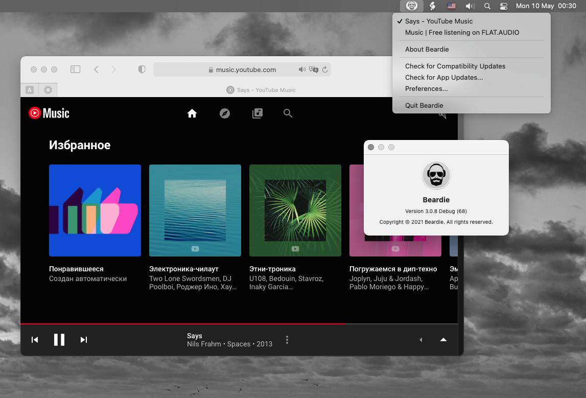
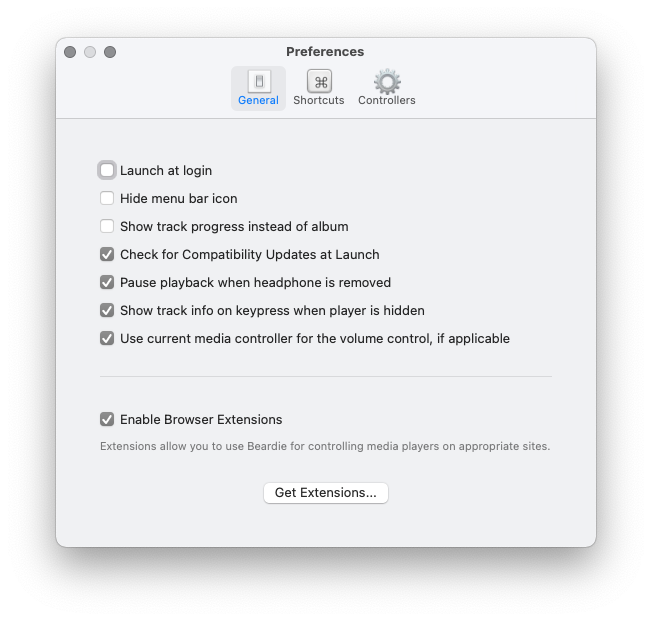
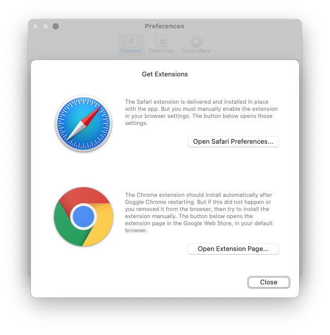
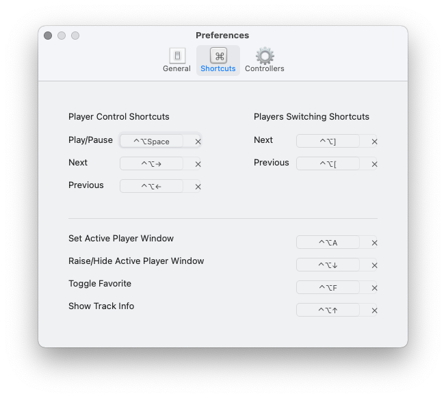
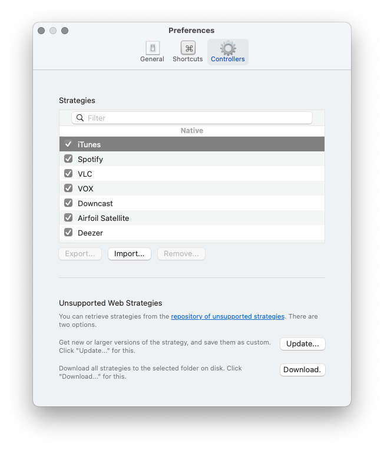

# Intro

Beardie is a utility that allows you to control various media players with your keyboard. It is a fork of the [BeardedSpice project](https://github.com/beardedspice/beardedspice). 

It allows you to manage web based players (*SoundCloud*, *YouTube* ... [List of supported sites to date](#supported-sites)) and native application players (*Apple Music*, *Spotify* ...). 

Beardie is more than just play/pause, it has some additional controls that add to the convenience. You can keep several player applications open, and several tabs of several browsers with web players, since Beardie "understands" what exactly you want to control at the moment. :) It also allows you to easily switch between running (open) players.

# Users Guide

## Install

**Mac OS X 10.14 or greater required.**

You can download the [latest release here](https://github.com/Stillness-2/beardie/releases/latest), or find a full list of all our [previously released binaries here](https://github.com/Stillness-2/beardie/releases).

In order for the Beardie to control web players, you need to enable the **Enable Browser Extensions** option in the `General` tab of the Beardie Preferences ((available through the menubar icon)).

The Beardie will offer to install a self-signed certificate in the keychain, this certificate will be used to encrypt the exchange between the application and the extensions. The exchange takes place over the WebSockets over SSL/TLS protocol.

You should also install the extension in the browser you are using.

The **Google Chrome** extension can be installed in other browsers that support extensions from the Chrome extension store, and most likely everything will work as expected. :)

## Features

### Supports media keys

Beardie supports players control with standard media keys of an Apple keyboards.

### Smart Mode

Beardie tries to automatically guess which *player* it should control for you. When you press any Beardie shortcut or media key with Beardie open, it will automatically control the site (native app) currently playing media, if you have no playing player, it will try to control the browser tab (if it is one of our supported sites) or native player app, which is currently focused, if Beardie failed to do either, it will automatically control the first.

### Keyboard Shortcuts
Beardie comes with a handy list of Keyboard Shortcuts that can be configured under the `Shortcuts` tab of the Beardie Preferences. Here is a default settings:

Very usefull command is **Raise/Hide Active Player Window**. For example, you are working with a document, and you are tired of the current playlist, which is playing from the site on one of the tabs in some browser window. Press the combination and Beardie will bring up the browser window and switch to the player tab. Change the playlist and press the combination again. Beardie will take you back to the document window, while restoring the sequence of windows and tabs in the browser as it was before.

If you are like me, love music, listen to it from different sources and cannot decide on the player :), then for sure you will have several players open at the same time. For this case, there are the **Players Switching Shortcuts**. They allow you to switch between open players. If you want to "look around", then before switching, execute the **Raise/Hide Active Player Window** command to raise the current player up, then switch between the players to the desired one, while each new current player will be raised up, re-execute **Raise/Hide Active Player Window**, to get back to work.

If the **smart mode** does not work properly, you can force the player to be active. To do this, use the **Set Active Player Window** command.

### Automatic Updates

Beardie will automatically notify you when a new release is available.

### Up to Date Media Strategies

First, what is a Media Strategy? This is what we call a [template](template-explained.js) with custom javascript aimed at a specific website, allowing the Beardie program to control it with the media keys.

Second, the Compatibility Updates option allows you to check for added or changed Media Strategies that were contributed since the last official release.

You can also exchange strategies between users in the form of files with the extension `bsstrategy`. In the application *Preferences*, in the *Controllers* section there are corresponding *Export/Import* buttons. There is a [repository with untested strategies](https://github.com/beardedspice/BS-Strategies).

### Supporting BeardedSpice Strategies

Since Beardie is a fork of BeardedSpice it fully supports the strategies created for BeardedSpice. There is also a convenient add/update function from **[Unsupported BeardedSpice Strategies repository](https://github.com/beardedspice/BS-Strategies)**. Use **Unsupported Web Strategies** section in settings.

### Disabling certain handlers
From the `Controllers` preferences tab, uncheck any types of webpages that you don't want Beardie to have control over. By default, all implemented handlers are enabled.

### Supported Mac OS X applications
- [iTunes](http://www.apple.com/itunes/)
- [Apple Music](https://www.apple.com/apple-music/) There is bug with default shortcut for next track. [Description here](docs/apple-music-app-issue.md)
- [Apple TV](https://www.apple.com/apple-tv-app/)
- [Spotify](https://www.spotify.com/)
- [VLC](http://www.videolan.org/vlc/)
- [VOX](http://coppertino.com/)
- [Downcast](http://downcast.fm/)
- [TIDAL](http://tidal.com/download)
- [Deezer](https://www.deezer.com/)
- [Airfoil Satellite](https://rogueamoeba.com/airfoil/satellite/)
- [Amazon Music](https://www.amazon.com/music/)
- [Quod Libet](https://github.com/quodlibet/quodlibet)

### Supported Browsers

 - [Safari](https://www.apple.com/safari/)
 - [Google Chrome](https://www.google.com/chrome/browser/desktop/) and other browsers, which support extensions for Google Chrome
 

### Supported Sites

The list of supported sites often changes, the current state of affairs can be found on **[this page](docs/supported-strategies.md)**, which is automatically generated.

#### Don't see your favorite site in the list?

Check, may be already exists a strategy, in the [repository with untested strategies](https://github.com/beardedspice/BS-Strategies)
